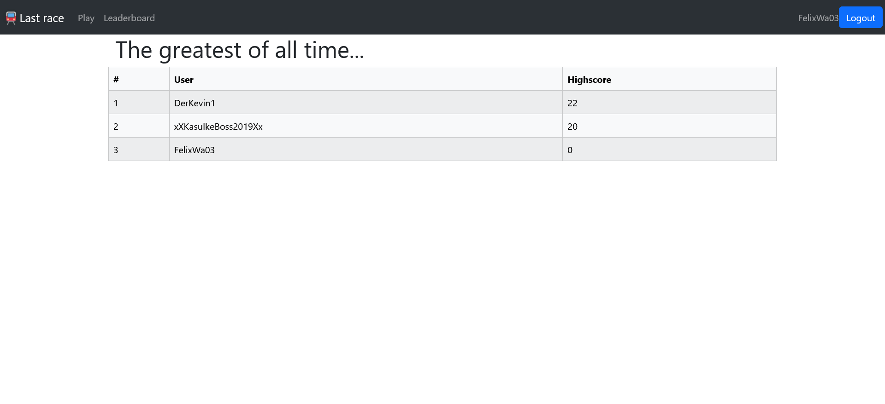
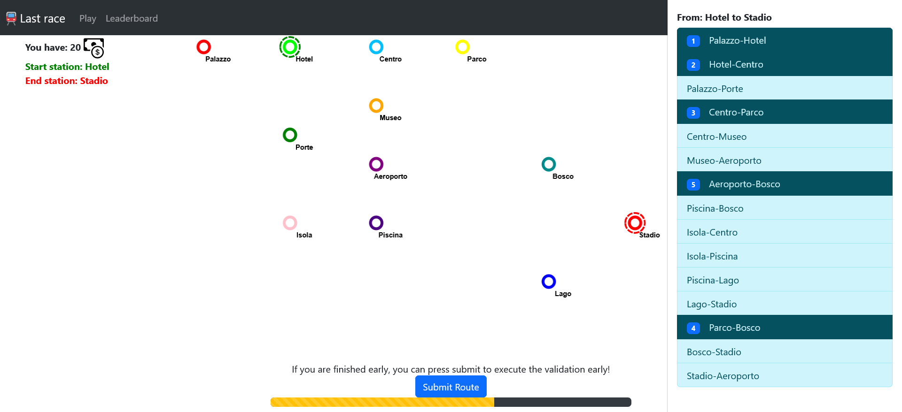

# Exam #1: "Last Race"
## Student: s362260 BEHNISCH JONAS 

## React Client Application Routes

- Route `/`: The default page for all users; Provides an Introduction to the website/rules of the game.
- Route `/play`: The page where the game is executed (all three phases: Network map, Planning and Execution).
- Route `/leaderboard`: The page displaying a table of all the highscores of all the users.
- Route `/login`: The page for user login.
- Route `/*`: A purposefully inserted route to catch if the user navigates outside the application and tell him.

## API Server

- POST `/api/session`
  - request body content: `{username: abc, password: def}` The username and password used for login.
  - response body content: `{id: x, username: abc, highscore: y}` The id and username for identification and the highscore for gameplay.
- GET `/api/sessions/current`
  - request parameters: -
  - response body content: `{id: x, username: abc, highscore: y}` Same as for login: The id and username for identification and the highscore for gameplay, only this time retrieved from session storage.
- DELETE `/api/sessions/current`
  - request parameters: -
  - response body content: -
- GET `/api/lines`
  - request parameters: -
  - response body content: `[{line: x, station_pairs:[station_1: y, station_2: z, ...]}, ...]` The list of lines and the pairs of stations they serve.
- GET `/api/stations`
  - request parameters: -
  - response body content: `[{name: abc, position_x: x, position_y: y, interchange: z}, ...]` the complete list of all stations in the database, with station names, positions (x,y) and whether they are interchange stations.
- GET `/api/randstartdest`
  - request parameters: -
  - response body content: `{startStation: x, endStation: y}` Responds with the random start/end station's names.
- GET `/api/event`
  - request parameters: -
  - response body content: `{event: {text: x, coinModificator: y}}` Responds with the event description and the amount of coins the player gains/loses (values from -4 to 4)
- POST `/api/highscore`
  - request body content: `{highscore: highscore}` the new user highscore.
  - response body content: `{newHighscore: result}` upon success returns the new user highscore.
- GET `/api/highscores`
  - request parameters: -
  - response body content:`{highscores: [{user: xx, highscore, yy}, ...]}` the complete list of all users and their highscores (order descending by highscore)

## Database Tables

- Table `users` - contains id username password salt highscore (The users, identifiable by id each have a username and password used for login (+ salt for additional encryption). The highscore is used to track a users position in the leaderboard.)
- Table `stations` - contains name position_x position_y interchange (The stations identifiable by name with postions x/y (for drawing them on the network map) and wether they are interchange stations.)
- Table `lines` - contains line station_1 station_2 (Used to track station_1 to station_2 connections served by line.)
- Table `events` - contains id description coin_modificator (Contains the random event descriptions, identifiable via id, each with a textual description and the coin_modificator from -4 to 4)

## Main React Components

- `App` (in `App.jsx`): Base for webapplication layout and routes. Also manages user authorization.
- `NavigationBar` (in `RulesPage.jsx`): Always present, allows navigation by clicking on the different texts/buttons and icon on the navigation bar.
- `RulesPage` (in `RulesPage.jsx`): Default page for all users; Explains the rules and prompts the user to login to be able to play.
- `LoginPage` (in `LoginPage.jsx`): Basicly one form group allowing the user to enter his username and password and logging in after pressing the submit button if password and username are correct.
- `LeaderboardPage` (in `LeaderboardPage.jsx`): Displays an ordered table of the users' highscores.
- `InfoToast` (in `InfoToast.jsx`): Main class for managing Toasts, which display short bits of information to the user e.g. for user errors, webpage errors, general information and events in game; Maps current toasts to `ToastPreset` (also in `InfoToast.jsx`).
- `GamePage` (in `GamePage.jsx`): Contains everything necessary to play the game; Renders a network map on a canvas using `paperjs`; Upon starting the game/ the planning phase, the canvas is transformed to inform the user about his position in the network, the start and end station and so on.; Displays a modal/pop up upon finishing the game, displaying score and highscore. For the planning procedure an Offcanvas with a list-group is provided.

## Screenshot

## Users Credentials
- username: DerKevin1, password: 123
- username: FelixWa03, password: MEalxoi3301
- username: xXKasulkeBoss2019Xx, password: 1dampfham!

## Use of AI Tools
No explicit use of AI Tools, however Googles search now also automaticly includes AI responses, sometimes i would use one of the links that the RAG delivered, but rarely the AI response itself. When i read the automatic AI response, i checked the sources provided for discrepancies.
